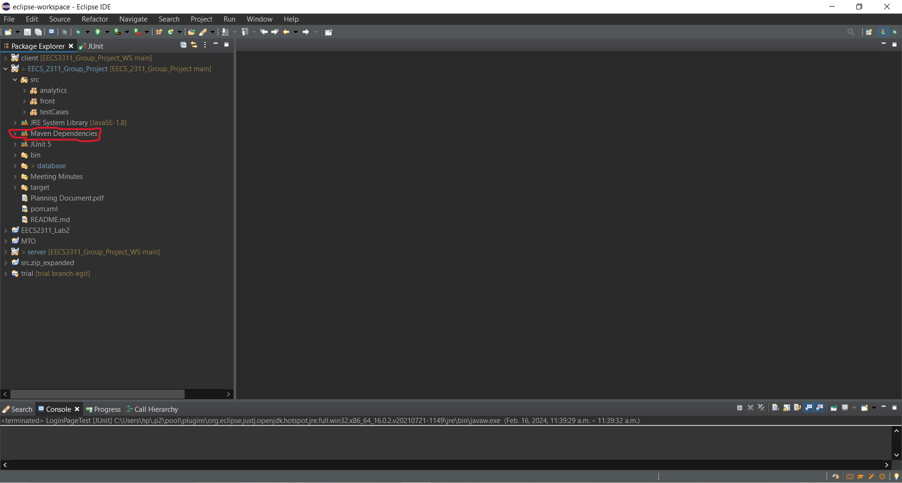
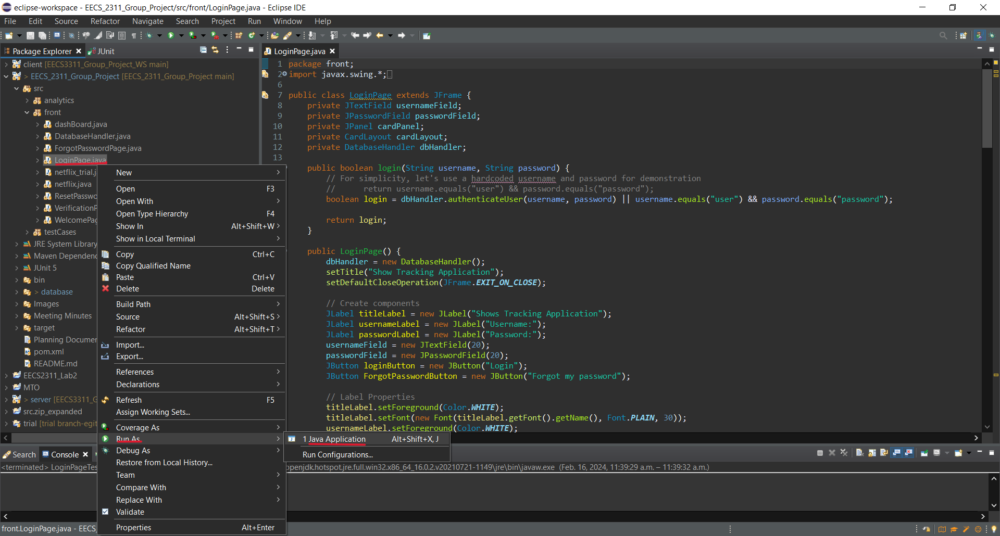
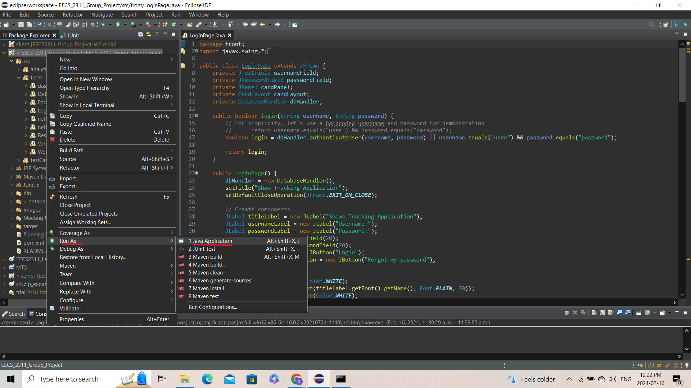
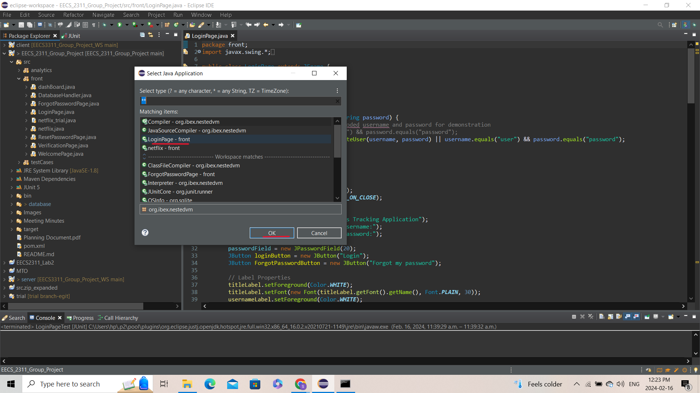
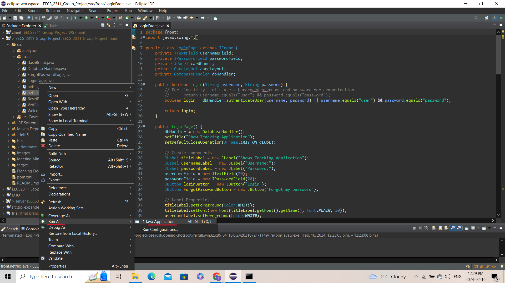
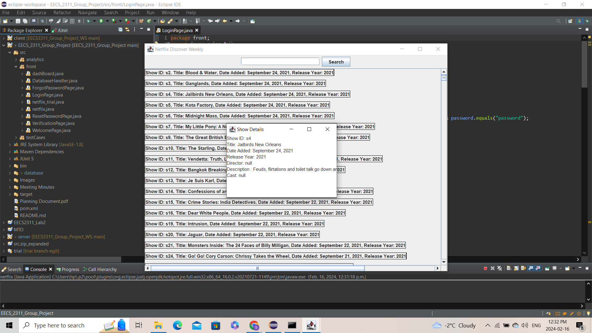
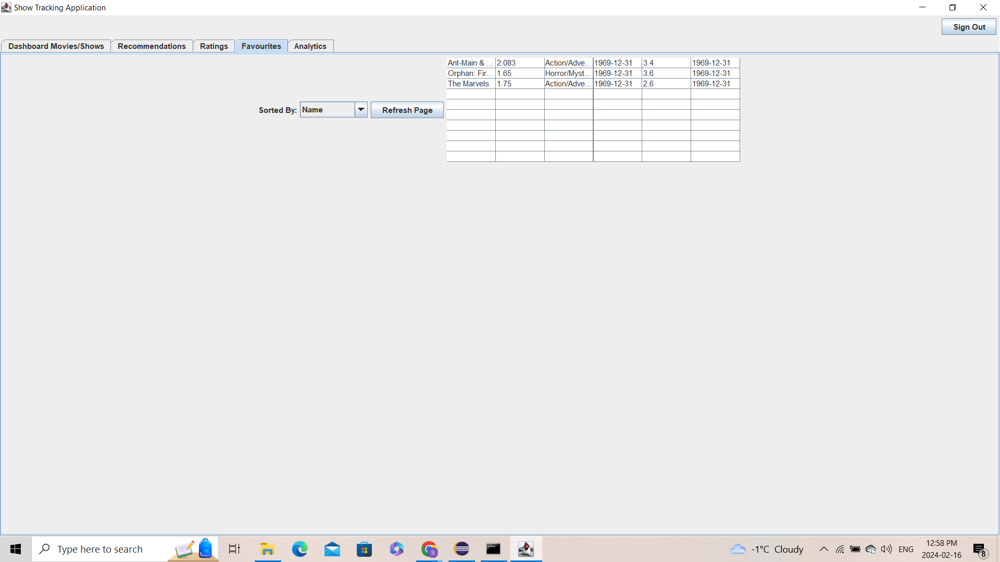
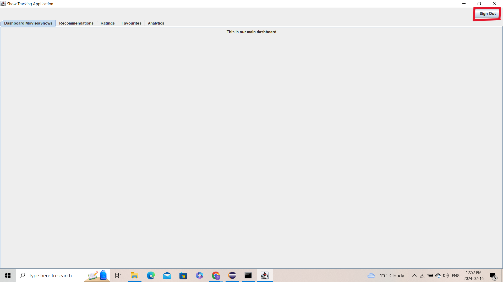

 

  

  <h3 align="center">ReadME</h3>

  

   This is the ReadMe File for EECS 2311 Group 1 Winter 2024
     
    <a href="https://github.com/ShaanCoding/ReadME-Generator"><strong></strong></a>
     
     
    <a href="">View Demo</a>
    .
    <a href="">Report Bug</a>
    .
    <a href="">Request Feature</a>
  

## Table Of Contents

* [About the Project](#about-the-project)
* [Built With](#built-with)
* [Getting Started](#getting-started)
  * [Prerequisites](#prerequisites)
  * [Installation](#installation)
* [Set Up](#Set-Up)
* [Usage](#usage)
  * [Launching the Main Application](#Launching-the-Main-Application)
  * [Launching the Movies/Shows thumbnail](#Launching-the-Movies/Shows-thumbnail)
  * [Sign Out - the Main Application](Sign-Out---the-Main-Application)
* [Contributing](#contributing)
* [Authors](#authors)
* [Acknowledgements](#acknowledgements)

## About The Project

The Show/movie Tracking web app is designed for users who do not have streaming subscriptions but would still like to know about upcoming movies/TV shows. The web app provides an in-time notification up to their preference, recommends trending shows on major streaming platforms like Netflix, Prime, etc., and gives users a thread-like comment place that allows users to develop deep discussions to share their thoughts with friends or people who are also into the shows. It also functions as an integrated hub that saves users the trouble of jumping from one platform to another.

## Built With

Java Swing

Java

DB Browser(Database)

## Getting Started

   
### Prerequisites

Before you begin, ensure you have the following software installed on your system:

1. Git - Version Control

2. Eclipse Community edition - The IDE to asociate the code with. Here, eclipse is primarily used.

3. Java Development Kit (JDK) version 8 or above: JDK is required to compile and run the Java application. Ensure JDK 8 or later is installed on your system. [Download JDK](https://www.oracle.com/java/technologies/javase/javase-jdk8-downloads.html)

4. Maven: This project uses Maven for managing dependencies and building the application. Maven simplifies the process of including external libraries such as JDBC drivers for SQLite, JFreeChart, and JavaMail API in the project. Ensure Maven is installed on your system. [Download Maven](https://maven.apache.org/download.cgi)

### Installation
To run Show Tracking web app, ensure you have Java installed on your system. Follow these steps:
1. Clone the repository: `git clone https://github.com/vaghani-shreya/EECS_2311_Group_Project.git`
2. Navigate to the project directory: `cd EECS_2311_Group_Project`
3. Run Maven Build: Execute `mvn clean install` to build the project and download the necessary dependencies automatically.
4. Run the application: Use the command `java -cp target/classes front.loginpage` to run the application.

 GitHub - https://git-scm.com/
 Eclipse Community edition - https://www.eclipse.org/community/
 Java - https://www.oracle.com/ca-en/java/technologies/downloads/
 (jre version 1.8)

## Set Up

1. Clone project - `git clone https://github.com/vaghani-shreya/EECS_2311_Group_Project.git`
2. Import Project in eclipse
3. Make sure after Importing, there is a library called Maven Dependencies in the project folder as shown below
  
If the maven dependencies cannot be resolved, sync maven dependencies  https://maven.apache.org/

## Usage

There are 2 parts to this iteration that have been not connected due to further developmentand required resources, they will be connected for future iterations.
They are 1. Launching the  main Application 
         2. Launching the Movies/Shows thumbnail 

  ### Launching the Main Application 
  There are 2 ways to launch the application , 

  1. Locate the LoginPage.java found under **src/front/LoginPage.java** in the Project folder and right click on it, scroll down to the **Run** option and click on **Java Application** to Launch the application.
     The process is witnessed in the Image below
     
      

2. Locate the **Project EECS_2311_Group_Project** in your eclipse Project explorer and right click on it, scroll down to **Run** option and Click on **Java Application** as shown below
   
    

   Then Click on **LoginPage-front** and click on **OK** to run the application. It is shown as below
   
    

   **Username** - user
   **Password** - password 

   
  ### Launching the Movies/Shows thumbnail
  There are 2 ways to launch the application ,

 1. Locate the netflix.java found under **src/front/netflix.java** in the Project folder and right click on it, scroll down to the **Run** option and click on **Java Application** to Launch the application.
     The process is witnessed in the Image below

     

2. Locate the Project **EECS_2311_Group_Project** in your eclipse Project explorer and right click on it, scroll down to **Run** option and Click on **Java Application** as shown below
   
   
    

   Then Click on **netflix-front** and click on **OK** to run the application. It is shown as below
   
    

   **NOTE - It takes a few seconds to Launch the Application as it is connected to a database and parsing data from the database**

   You can search any movie/show from the search bar and click search. You can also click on a Movie/Show to check out the details of that particular Movie/Show

     

### Exploring Functionailties 

You can use the **username** - user , **password** - password to login into the system and explore the application.You can use the **pin** - 12345 to change the password as well just for this iteration. Th next iteration has an email feature that will send the pin to your email that will be developed.

After Logging into the Main Application, you can click on the different tabs to checkout the features that are currently implemented such as **Favourites page** and **Movies/Show page(indepent launch as of now)** and the **sign out** feature.

   

### Sign Out - the Main Application

To Sign out from the Mainn application, click on the Sign out button on the right hand side of the application.

<<<<<<< HEAD
 

 **NOTE** - There is no sign out button to the netflix application as it will be a component of the Main application for the next iteration.

## Authors
- Mai
- Elizabeth
- Anusha
- David
- Shreya
- Huiling

## Acknowledgements
- Thanks to Hadi Hemmati, the EECS 2311 instructor and Hamed Taherkhani, the TA, for their invaluable guidance.

=======
## License

## Authors

- Mai: Implemented The Netflix “Discover Weekly” page where users can search for a certain show from Netflix.
- Elizabeth: Implementing the login page
- Anusha: Implemented the Forgot Password Function
- David: Implemented the Favourites Page
- Shreya: Implementing the dashboard with all the different pages
- Huiling: Implementing the detailed page for each entry 

## Acknowledgements

- Thanks to Hadi Hemmati, the EECS 2311 instructor and Hamed Taherkhani, the TA, for their invaluable guidance.
- Special thanks to [JFreeChart](http://www.jfree.org/jfreechart/) for the charting tools.
>>>>>>> d2c9357061c05c44d93b3e9f4a61d3cdd7883354
